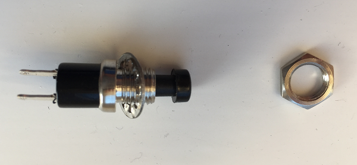
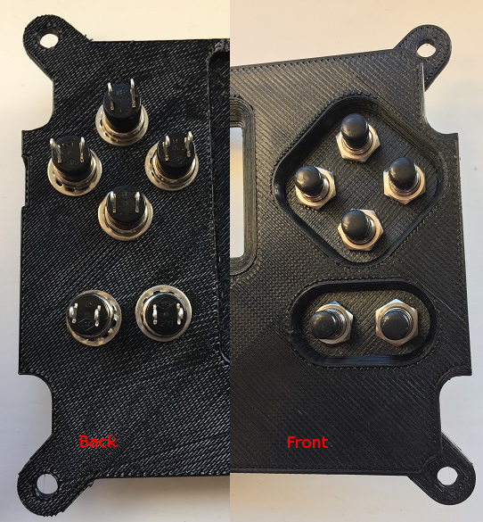

## Install the push-buttons

This section assumes you are using the buttons from the Astro Pi [components kit](http://cpc.farnell.com/ucreate/uc-apk-comp1/astro-pi-component-kit-budget/dp/SC14158){:target="_blank"} from CPC. If you are using the APEM buttons or another type of button, these may differ in their installation.

+ Take a button, then unscrew and remove the nut. Sometimes the nut will get stuck on the button cap, but it should come off if you wiggle it.

+ Keeping the washer on the thread, insert the button from the underside of the lid.

+ Then on the top side of the lid, put the nut back on and tighten it with your fingers. Check that the connectors are aligned horizontally on the underside before tightening fully.

+ Do the same for the remaining buttons; when you are done it should look like this:

If you are using the lid with the pilot holes then you'll need to check the datasheet for your chosen button type to find the **threaded bushing diameter**. Once you know this you can select a drill bit with this diameter, plus 1mm for clearance, and proceed to drill all six holes. We recommend using a vice or G clamp to hold the lid in place while you drill. You can then install the buttons in accordance with their requirements.
