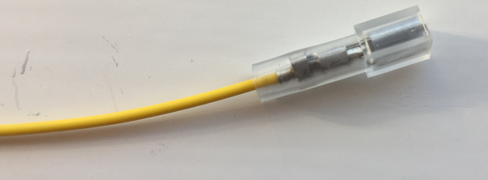
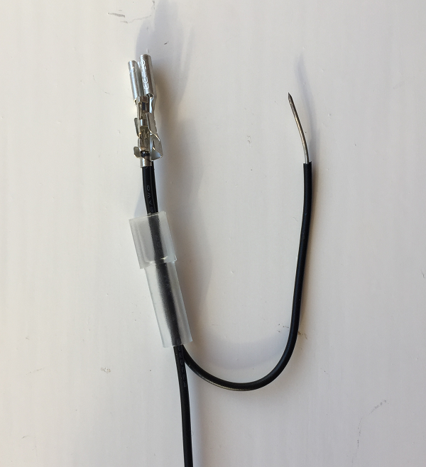
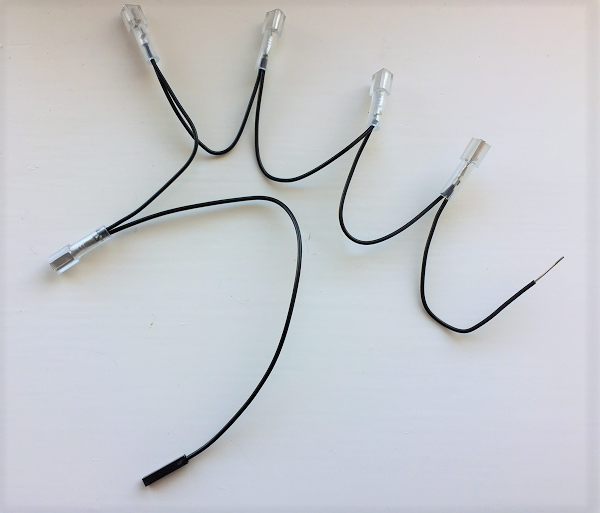

## Create the button wires

Firstly, you need to prepare the button wires to be able to attach them to the buttons. In the real flight unit, we soldered the button wires on to make them more reliable — in the kit you will find jumper wires which will do the same job. The colour of the wires is not important, as they are all exactly the same inside.

+ Take a coloured wire and, without cutting it, remove the black plastic sheath from **one** end. You can do this by pulling it off with wire cutters, or by pulling up the small tab and removing it by hand. This exposes a pin connector.

+ Pass a plastic insulation boot over the pin connector narrow end first, and slide it out of the way down the wire. Then place the connector inside a crimp.

+ Alternating the angle of your pliers, squash the crimp around the wire until there is no movement whatsoever of the pin connector within the crimp. Then slide the insulation boot back up over the wire and crimp.

+ Repeat this six times with the other coloured jumper wires to create the wires we will connect to the six buttons.

Instead of connecting six more wires to the Raspberry Pi as ground wires, you will create a ground loop wire which connects to all of the buttons. This technique is also used in the real flight units.

+ Take the piece of black wire, which should be approximately 50cm in length. Using a ruler and wire cutters, make five 10cm lengths.

+ For each length, use wire strippers to expose at least 1cm of bare wire on both ends, then bend the wire into a U shape.

+ Now take a black jumper wire and remove the black plastic sheath from one end to expose the connector, just as you did before.

+ Hold the connector next to the end of one of your 10cm lengths of black wire, and pass both wires through the narrow end of an insulation boot.

+ Insert both wires together into a crimp and tighten the crimp as before.

+ Connect up the four remaining lengths of black wire to create a chain, crimping together a new wire with the exposed bare end of the previous wire. You will be left with one bare wire end as in the photograph below.

+ For the final end, use pliers to fold the bare wire over to make it twice as thick before putting this wire alone inside a crimp and tightening up as before. You should end up with a chain containing six crimped ends and one black plastic jumper end.
