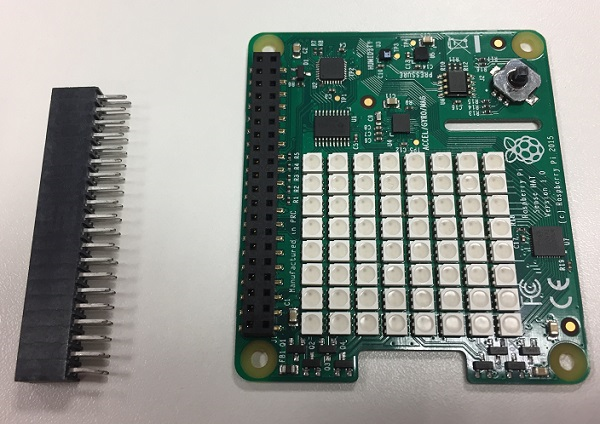

## Install the Sense HAT

Remove the GPIO connector that comes with the Sense HAT; wiggle it from side to side and it will come off without too much force. The Sense HAT can then be inserted onto the extended header. Note that these pins should not protrude through the top of the Sense HAT. If they do, then the height is not correct.

Finally, use the M2.5 cross-head screws to secure the Sense HAT to the stand offs below.

