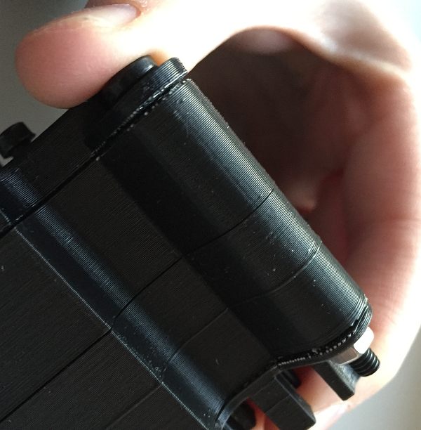

## Assemble the case

Once you're happy that the internals of the case are complete, you can proceed to the final assembly stage.

+ Take the lid and gently tuck the wires into the space on the right of the Pi as neatly as you can.

+ Place the lid on top of the case and align the heat sink on the bottom.

+ Take the black M4 threaded bolts and insert one through each of the holes in the corners of the case. Inserting all four bolts at this stage will help to line everything up and make it easier to secure the case with the nuts.

+ Take one of the large hex nuts and with your index finger place it against the bottom of the bolt. Push the bolt back up so that the nut is then flush with the bottom of the case, and turn the head of the nut with your finger and thumb so that it catches the bolt thread. Tighten the nut with your fingers only.

+ Once all four nuts are in place you can do a final tighten with a screwdriver.

+ Your Astro Pi is almost complete; the last thing to do is install your 3D-printed joystick cap by pressing it onto the joystick. For this, the real flight units use a TrackPoint cap from a Lenovo ThinkPad laptop!

