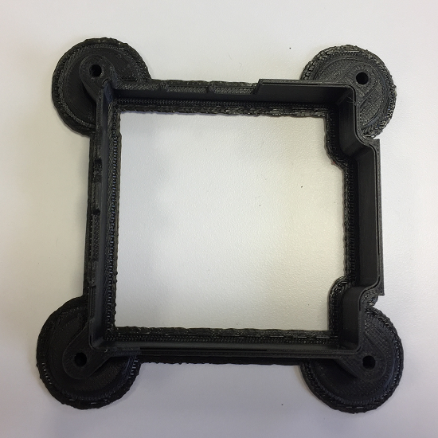

## Print each part

**It is important that you observe the correct safety procedures specified in the data sheet for your specific 3D printer.**

Potential hazards include:

- Hot surfaces and thermoplastics (print head block and lamp)
- Ultraviolet radiation (lamp)
- High voltage (lamp connector, electric outlet)
- Moving parts (printing assembly)

The 3D printer we used for the black parts shown was an [Up Plus 2](https://www.3dhubs.com/3d-printers/up-plus-2){:target="_blank"}, called the Afinia H480 in the US, using ABS filament. There are many different 3D printer models, and we cannot possibly provide instructions for them all. We can only provide rough guidance here, and you'll need to figure out the rest on your own.

Here are some top tips:

- Spend some time making sure your printer is properly calibrated and tested
- [PLA](https://en.wikipedia.org/wiki/Polylactic_acid){:target="_blank"} is more reliable and nicer to print with than [ABS](https://en.wikipedia.org/wiki/Acrylonitrile_butadiene_styrene){:target="_blank"}
- A [Zebra](http://www.printinz.com/zebra-plates/){:target="_blank"} or [Buildtak](http://www.buildtak.eu/){:target="_blank"} plate provides a great surface to print on and doesn't require any extra adhesive
- If your printer has a Z probe sensor, this will help compensate for the bed not being perfectly level — if you have one, ensure it's working correctly

In order to get a nice finish we recommend you print on a high detail setting; this is usually a number specified in [microns](https://en.wikipedia.org/wiki/Micrometre){:target="_blank"} in the 3D printer software. The lower this number is, the more precise the model will be. Please also be aware that precise prints take longer and, for the models you're going to make, each piece can take up to **four** hours to complete. Make sure you have enough filament.

The STL files should have the models in the right orientation by default, but please make sure you print in the orientations shown below in order to minimise scaffolding and rafting.

### Heat sink

### Base

### Middle

### Lid

