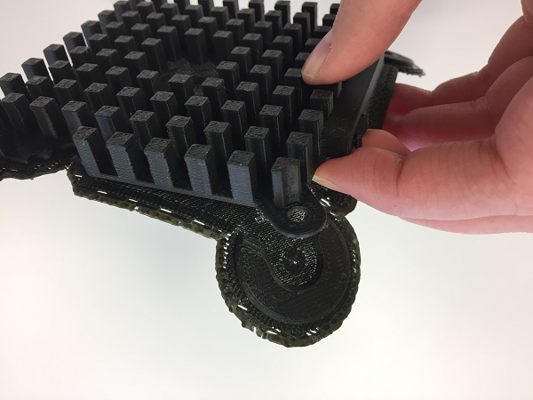
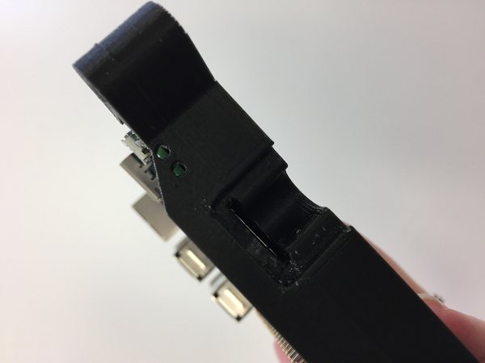
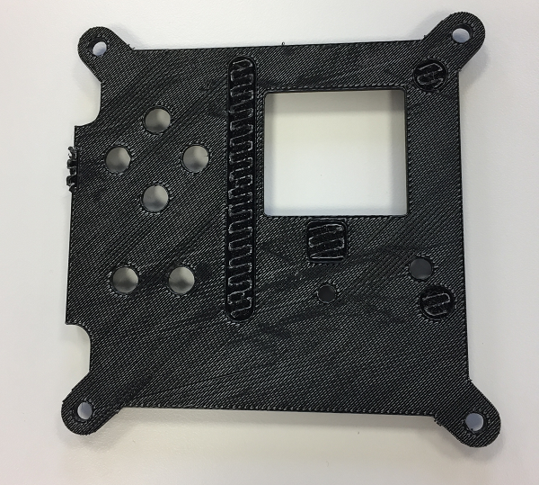
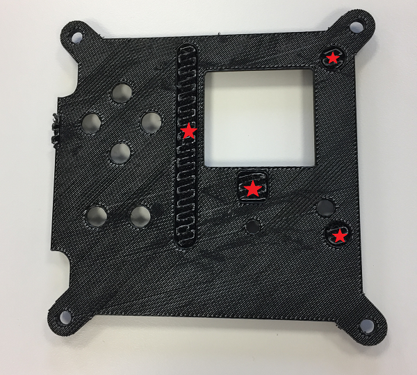

## Remove the scaffolding

In order to keep the model structurally sound while printing, your 3D printer will create what's called scaffolding and rafting to prevent the hot thermoplastics from bending or sagging. Leave the print to cool right down to room temperature before you touch it.

### Heat sink

You should be able to remove the scaffolding on the heat sink using just your hands; this part may bend slightly, so don't be too rough while you are removing the unwanted material.

You may choose to not print this part because it's not essential to the rest of the case, and because it's made of plastic it **will not** work as a heat sink. We've included it, though, so that you can achieve the iconic look and feel of the Astro Pi flight case.

### Base

The base scaffolding should come away easily as with the heat sink.

If the scaffolding breaks off unintentionally, carefully prise up the remaining scaffolding using a scalpel and then continue peeling it off with your fingers.

Don't worry if you scuff the surface with the scalpel as the rough side of the print will not be visible when the case is assembled.

Don't forget to clear the material around the SD card slot; this can easily be done with pliers.

### Middle

Again, the scaffolding should come away easily by peeling it with your fingers.

### Lid

Peel off the bottom layer of scaffolding as before.

However, there are a few sunken holes on the underside that must also be cleared of material. These are present to prevent the lid from striking the Raspberry Pi hardware when it is installed in the case. You'll need a scalpel or craft knife to dig into it.

Once you've managed to lift some of it, use a small pair of pliers to remove the rest of the material. The areas marked with a red star below need the same treatment.

When you're done it should look like this:

