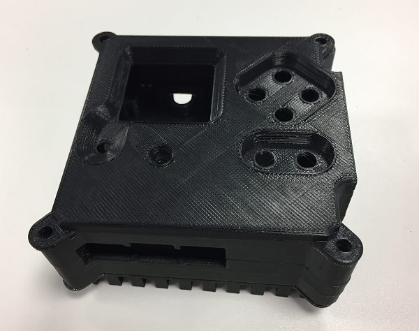

## Do a fit check

Before proceeding, put all the pieces together to check that they fit correctly. The lipped edge between the base and middle pieces is of most concern to you here. The heat sink and lid just need to line up.

Don't worry about any imperfections or residue from the scaffolding at this stage; you can tidy this up later with sandpaper.

