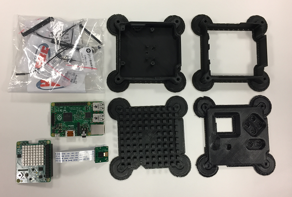
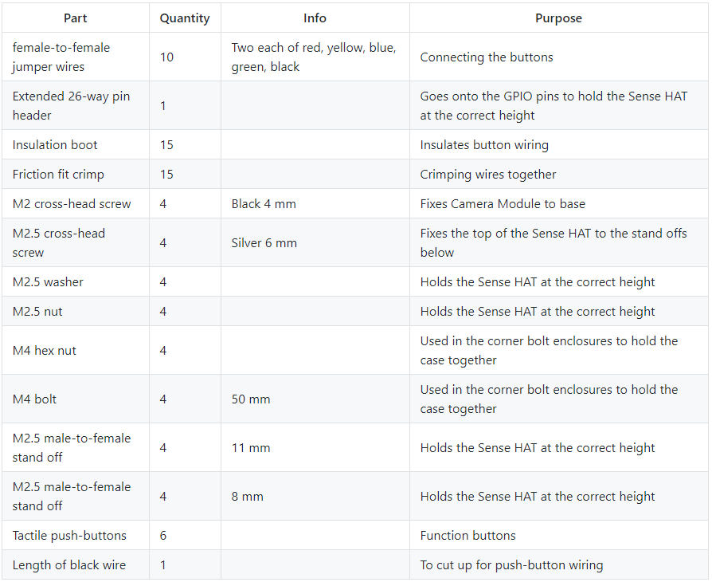

## Parts checklist

Alongside your 3D-printed parts, check that you have all of the other parts required before you start:

If you're planning to build a full Astro Pi flight unit, you can purchase a [kit containing the required components](http://cpc.farnell.com/ucreate/uc-apk-comp1/astro-pi-component-kit-budget/dp/SC14158) from CPC.

--- collapse ---
---
title: Full list of kit parts
---

--- /collapse ---

The kit already contains buttons, but if you want to buy the exact buttons used in the Astro Pi flight unit, the details are below. At a price of £9 each. they are expensive — that's because they're designed to survive an enormous number of clicks before wearing out, a feature which is necessary for a seven-year space mission.

- Manufacturer: APEM
- Manufacturer Part No: 104350003
