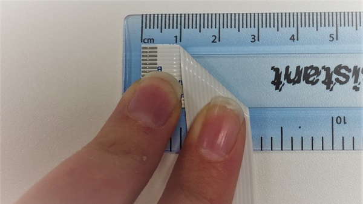
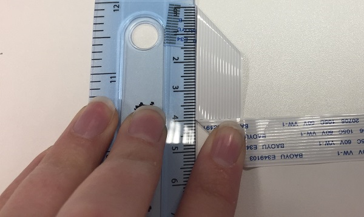
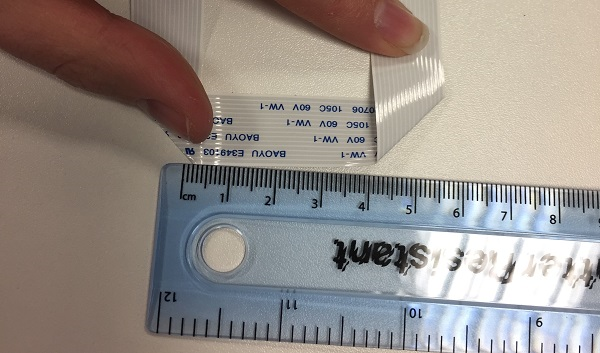
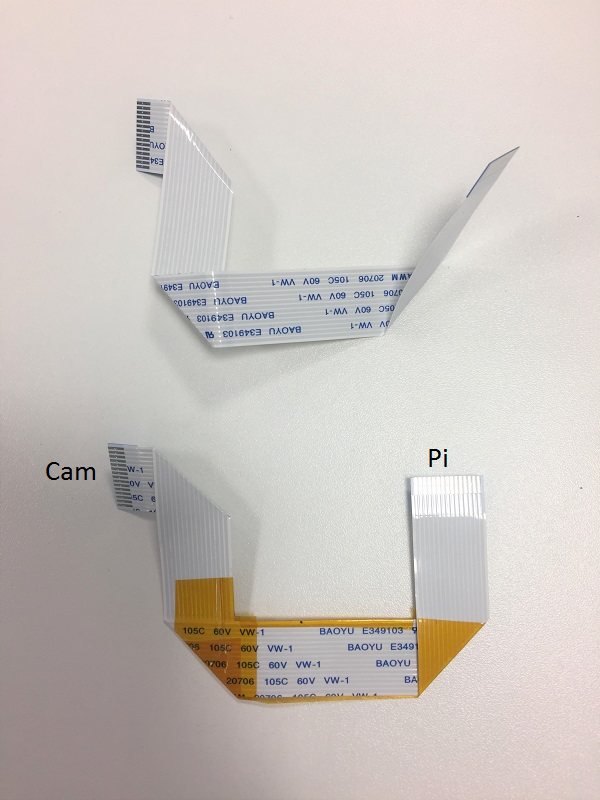
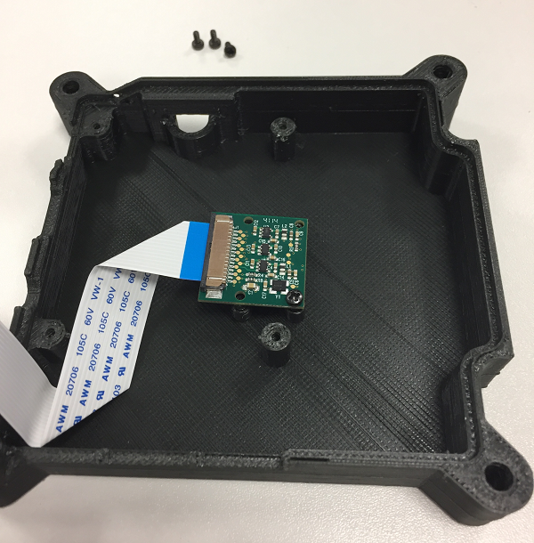

## Install the camera

When you're happy with the 3D-printed parts you can proceed with installing the hardware.

Getting the camera into the case can be a little tricky but here is how we did it for the flight units. Firstly, lift the two tabs on either side of the Camera Module to disconnect the ribbon cable from the camera. Then fold the ribbon. These folds allow the camera cable to come up the side of the Raspberry Pi with enough flex to insert into the CSI camera port (see further down).

- Lay the ribbon out with the writing face up and the visible connectors on the left. At 1cm along the ribbon, fold the ribbon downwards.

  

2. Now measure 4cm from the top of the ribbon and fold the ribbon to the right.

  

3. Finally, measuring 4cm from the bottom-left corner, fold the ribbon upwards.

  

4. Tape the ribbon on the bottom to prevent it from unfurling. We have used kapton tape but any kind of tape will work fine.

  

You don't need to get this perfect for it to work, but try to get it as close as possible.

Reconnect the **Cam** end of the ribbon cable to the Camera Module. Make sure that the tin connectors are facing the front and the blue tab is on the back.

Before proceeding, line the Camera Module up with the support pillar pilot holes and have a look through the aperture in the base to check the alignment of the lens. The lens block of the Camera Module is actually glued in position at the factory, and therefore its alignment can vary slightly from camera to camera. If you find you've got an alignment issue, you should be able to manipulate the lens block between finger and thumb before you install it into the case permanently.

When you're happy, use the small black M2 cross-head screws to install the Camera Module. The screws will cut their own thread in the support pillar pilot holes, but after a few turns you'll probably need a small screwdriver to continue.

Stop turning as soon as the head of the screw touches the Camera Module; if you tighten the screw too much it can cause the support pillar to split horizontally along the grain of the print. Furthermore, try to avoid removing and re-threading the screws as this will cut a new thread and, if done repeatedly, will erode the inside of the support pillar so that the screws will not hold.
