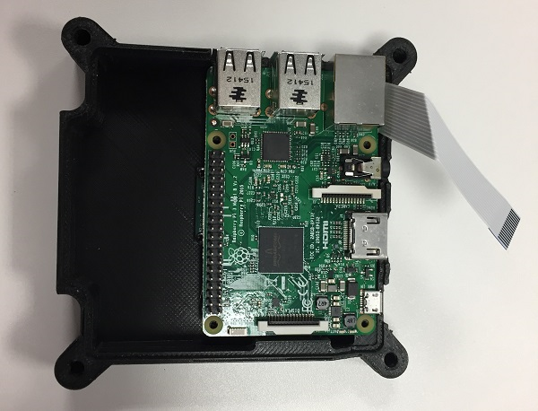
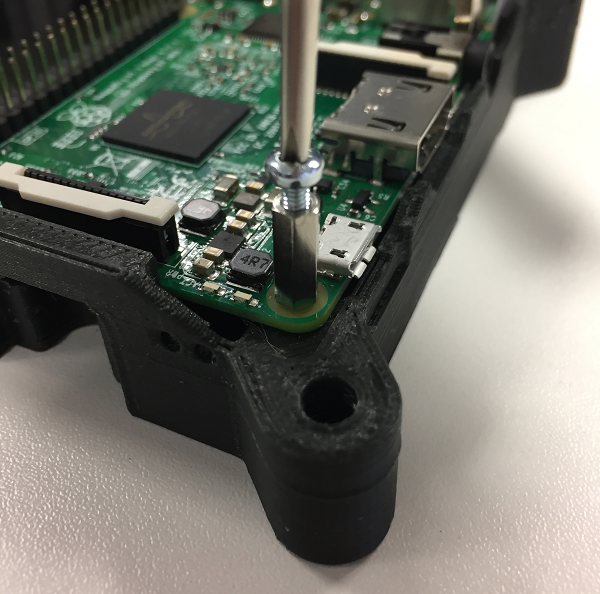

## Install the Raspberry Pi

+ Firstly, ensure there's no residual scaffolding material around the SD card slot or LED holes that might prevent the Raspberry Pi from lining up with the mounting pillars.

+ Once you're happy, line the Raspberry Pi up and do a fit check. Verify that it doesn't touch the Camera Module below it. Don't insert the camera ribbon cable just yet, as this will make the next job awkward.

+ Next, screw the M2.5 11mm stand offs into each corner of the Pi. With some light finger pressure they will cut their own thread in the support pillar pilot holes. After a few turns you'll need to use a small pair of pliers to continue turning them. It's possible to get these to go in at a slight angle, which can lead to alignment issues with the Sense HAT later on, so do your best to make sure they go into the support pillars as straight as possible. Be careful while you do this and, again, stop turning as soon as the stand off touches the Raspberry Pi to avoid splitting the pillars horizontally along the grain of the print.

If you are having trouble screwing in the stand offs, screw one of the silver M2.5 cross head screws into the stand off, then use the screw head to screw the stand off into the case. Once the stand off is in place, don't forget to remove the screw.

+ You can now insert the camera ribbon cable into the CSI port of the Raspberry Pi. Try to make sure the tin connectors are all level to ensure a good connection.
