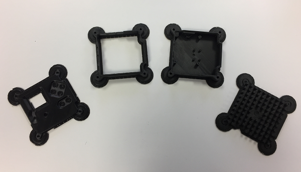
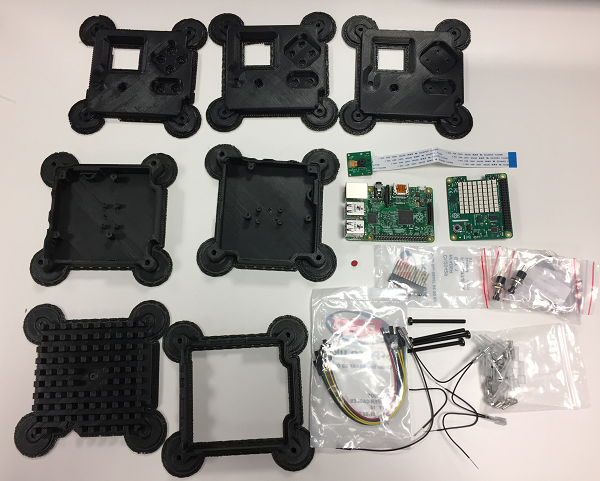
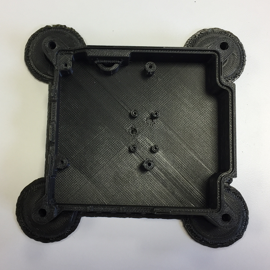

# 3D printed Astro Pi flight case

The Astro Pi flight case is one of the most desirable cases in the history of the Raspberry Pi. With this resource you will learn how to 3D print your own case and install the Astro Pi hardware inside it. You'll then have your very own Astro Pi flight unit, identical in almost every way to the ones on the International Space Station right now.

If you're participating in an Astro Pi competition, this is a great way to prototype and efficiently test your code in the same way as it would be used by the crew of the ISS.

## Checklist

If you're planning to build a full Astro Pi flight unit, you can purchase a [kit containing the basic components](http://cpc.farnell.com/ucreate/uc-apk-comp1/astro-pi-component-kit-budget/dp/SC14158) (marked below with a \*).

Check that you have all the parts required before you start:

Part|Quantity|Info|Purpose
---|---|---|---
Raspberry Pi|1|B+, 2B or 3B|Main computer
Camera module|1|Normal or Pi NoIR|Main camera
Sense HAT|1|&nbsp;|Main sensors
\*F-F Jumper wires|10|2 each of Red, Yellow, Blue, Green, Black|Connect the buttons
\*Extended 23 way pin header|1|&nbsp;|Goes onto the GPIO pins to hold the Sense HAT at the correct height
\*Insulation boot|15|&nbsp;|Insulates button wiring
\*Friction fit crimp|15||Crimp wires together
\*M2 cross head screw|4|Black 4mm|Fixes camera module to base
\*M2.5 cross head screw|4|Silver 6 mm|Fixes the top of the Sense HAT to the stand offs below
\*M2.5 washer|4|&nbsp;|Holds the Sense HAT at the correct height
\*M2.5 nut|4|&nbsp;|Holds the Sense HAT at the correct height
\*M4 hex nut|4|&nbsp;|Used in the corner bolt enclosures to hold the case together
\*M4 bolt|4|30 mm|Used in the corner bolt enclosures to hold the case together
\*M2.5 male-to-female stand off|4|11 mm|Holds the Sense HAT at the correct height
\*M2.5 male-to-female stand off|4|8 mm|Holds the Sense HAT at the correct height
\*Tactile push buttons|6|&nbsp;|Function buttons
\*Jumper wire|1|&nbsp;|To cut up for push button wiring
Joystick cap|1|3D printed|Goes on the Sense HAT joystick

The Astro Pi kit already contains buttons, but if you want to buy the exact buttons used in the Astro Pi flight unit, the details are below. At about £9 each they are expensive, because they're designed to survive an enormous number of clicks before wearing out - necessary for a 7-year space mission.

- Manufacturer: APEM
- Manufacturer Part No: 104350003

You're also going to need the following tools:

- Small cross head screwdriver
- Small pair of pliers
- Craft knife or scalpel
- Sand paper
- Tape
- Wire strippers
- Wire cutters

## Get access to a 3D printer

First and foremost, you'll need access to a 3D printer to do this. Many schools now have their own, but if your school doesn't then you may be able to find one at your local [hackspace](http://www.hackspace.org.uk/wiki/Main_Page). You can also find local 3D printing services through the [3D Hubs](https://www.3dhubs.com/) website.

## Get the 3D files

The 3D files are in [STL](https://en.wikipedia.org/wiki/STL_%28file_format%29) format, which is widely used in 3D printing all over the world. The software for your 3D printer will have no problem loading them. Import using metric millimetres (mm) and no scale adjustments will be required.

You can choose between printing using the standard STL file or the anti-warping STL file for each component. The anti-warping files add extra scaffolding around the case print to prevent the part becoming warped as it cools.

Print **one** file from each section:

**Part 1 - Heat sink**

* [Heat Sink](STL/Astro_Pi_Heat_Sink.stl) or [Anti-warp Heat Sink](STL/anti-warping/Astro_Pi_Heat_Sink_warp.stl)

**Part 2 - Base**

* [Base for Pi 2](STL/Astro_Pi_Base_Pi1_or_2.stl) or [Anti-warp base for Pi 2](STL/anti-warping/Astro_Pi_Base_Pi1_or_2_warp.stl)
* [Base for Pi 3](STL/Astro_Pi_Base_Pi3.stl) or [Anti-warp base for Pi 3](STL/anti-warping/Astro_Pi_Base_Pi3_warp.stl)

**Part 3 - Middle**

* [Middle](STL/Astro_Pi_Middle.stl) or [Anti-warp middle](STL/anti-warping/Astro_Pi_Middle_warp.stl)

**Part 4 - Lid**

* [Lid 10mm](STL/Astro_Pi_Lid_10mm_Buttons.stl) or [Anti-warp lid 10mm](STL/anti-warping/Astro_Pi_Lid_10mm_Buttons_warp.stl) - 10mm holes, for use with the APEM buttons
* [Lid 7mm](STL/Astro_Pi_Lid_7mm_Buttons.stl) or [Anti-warp lid 7mm](STL/anti-warping/Astro_Pi_Lid_7mm_Buttons_warp.stl) - 7mm holes, for use with the buttons from the kit
* [Lid - 3mm](STL/Astro_Pi_Lid_3mm_Pilot_Holes.stl) or [Anti-warp lid - 3mm](STL/anti-warping/Astro_Pi_Lid_3mm_Pilot_Holes_warp.stl) - 3mm pilot holes, for drilling to fit any button size

**Part 5 - Joystick**

* [Joystick](STL/Astro_Pi_Joystick.stl)

The 3D files don't exactly match those used to make the aluminium flight cases on the Space Station. They have been modified to make them compatible with 3D printers, so that most people who attempt this will achieve success without difficulty.

Most notably, the case has been sliced into four parts. This has been done to minimise the amount of rafting and scaffolding that needs to be printed along with the model, and also reduces the time you spend cleaning up the final prints.

## Safety first

**It is important that you observe the correct safety procedures specified in the safety data sheet for your specific 3D printer.**

Potential hazards include:

- Hot surfaces and thermoplastics (print head block and lamp)
- Ultraviolet radiation (lamp)
- High voltage (lamp connector, electric outlet)
- Moving parts (printing assembly)

## Print each part

The 3D printer we used for the black parts shown below was an [Up Plus 2](https://www.3dhubs.com/3d-printers/up-plus-2), called the Afinia H480 in the US, using ABS filament. Because there are so many different types of 3D printer, we cannot possibly provide instructions for them all, so we can only provide rough guidance here and you'll need to figure out the rest on your own.

Here are some top tips though:

- Spend some time making sure your printer is properly calibrated and tested
- [PLA](https://en.wikipedia.org/wiki/Polylactic_acid) is more reliable and nicer to print with than [ABS](https://en.wikipedia.org/wiki/Acrylonitrile_butadiene_styrene)
- A [Zebra](http://www.printinz.com/zebra-plates/) or [Buildtak](http://www.buildtak.eu/) plate provides a great surface to print on without any extra adhesive being required
- If your printer has a Z probe sensor, this will help compensate for the bed not being perfectly level; ensure it's working correctly if you have one

To get a nice finish we recommend you print on a high detail setting; this is usually a number specified in [microns](https://en.wikipedia.org/wiki/Micrometre) in the 3D printer software. The lower this number is, the more precise the model will be. Please also be aware that precise prints take longer and, for these models, each piece can take up to **four** hours to complete. Make sure you have enough filament.

The STL files should have the models like this by default, but please make sure you print in the orientations shown below in order to minimise scaffolding and rafting.

### Heat sink

### Base

### Middle

### Lid

## Remove the scaffolding

In order to keep the model structurally sound while printing, your 3D printer will create what's called scaffolding and rafting to prevent the hot thermoplastics from bending or sagging. Leave the print to cool right down to room temperature before you touch it.

### Heat sink

You should be able to remove the scaffolding on the heat sink using just your hands; this part may bend slightly, so don't be too rough while doing this.

You may choose to not print this part because it's not essential to the rest of the case, and because it's made of plastic it *will not* work as a heat sink. We've included it anyway so that you can achieve the iconic look and feel of the Astro Pi flight case.

### Base

The base scaffolding should come away easily as with the heat sink, but you'll also need to remove some material that was used to support the corner bolt enclosures and around the aperture for the micro SD card. A small pair of pliers is ideal for this.

### Middle

Again, the scaffolding should come away easily and there will be some material around the corner bolt enclosures that you'll need to remove.

### Lid

The bottom layer of scaffolding on the lid should also come away easily.

However, there are a few sunken holes on the underside that must also be cleared of material. These are present to prevent the lid from striking the Raspberry Pi hardware when installed into the case. You'll need a scalpel or craft knife to dig into it.

Once you've managed to lift some of it, use a pair of small pliers to remove the rest of the material. The areas marked with a red star below need the same treatment.

When you're done it should look like this:

## Do a fit check

Before proceeding, put all the pieces together to check that they fit correctly. The lipped edge between the base and middle pieces is of most concern to you here. The heat sink and lid just need to line up.

Don't worry about any imperfections or residue from the scaffolding at this stage; you can tidy this up later with sandpaper.

## Epoxy adhesive

Use some high-performance epoxy adhesive to glue the heat sink to the base, and then the lid to the middle. You may wish to leave this step until after you've installed the hardware in the base. It may help mitigate any alignment issues later on.

## Continue to install the hardware

- [Worksheet 2](worksheet2.md)
