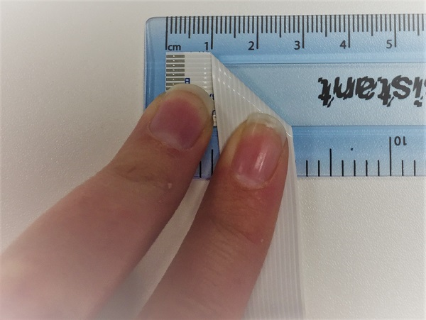
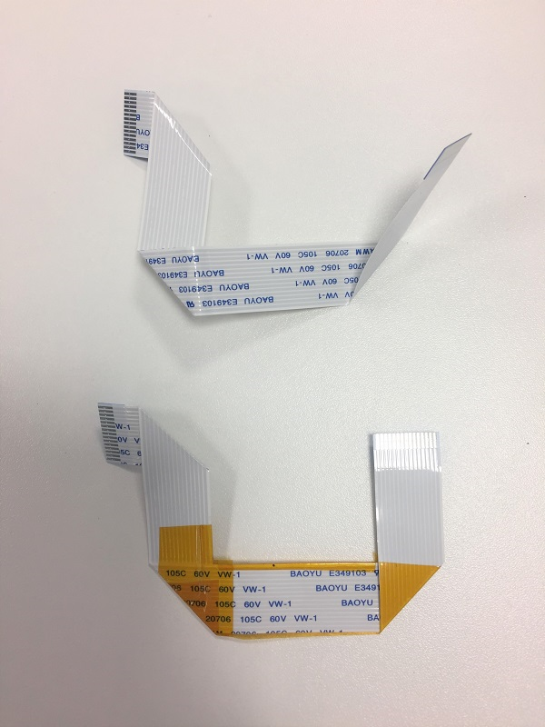
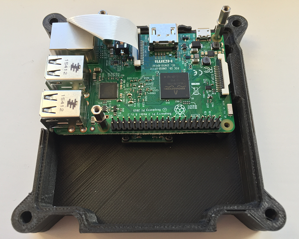
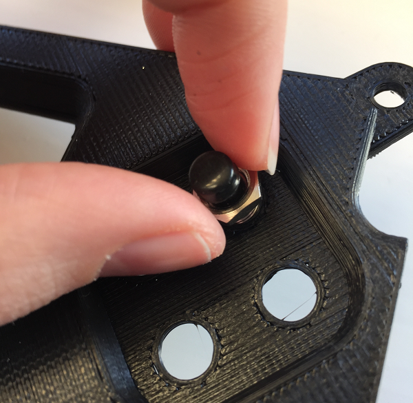
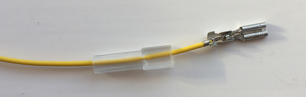
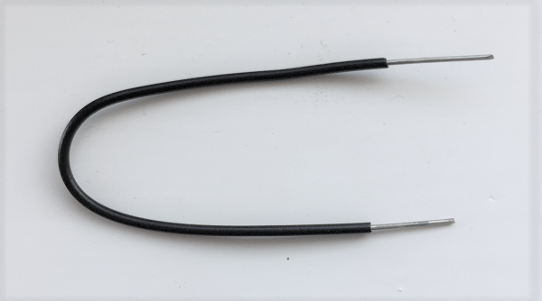
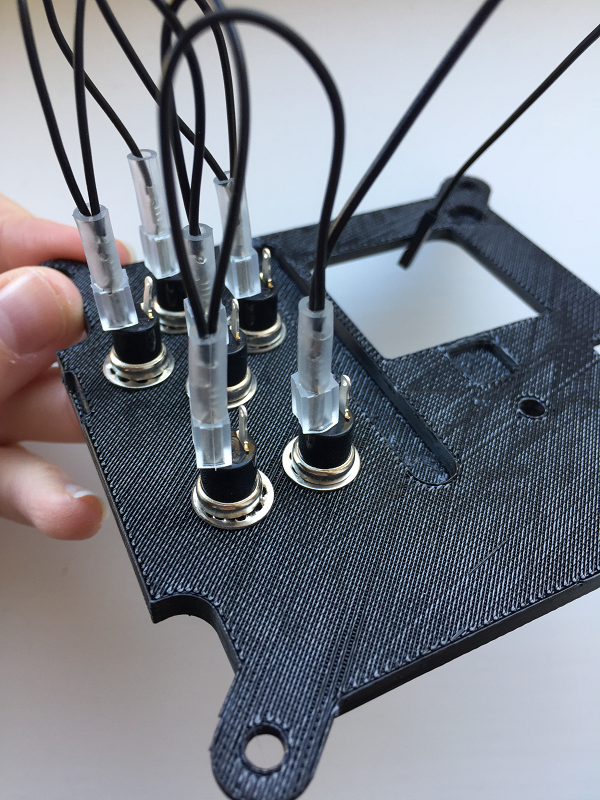
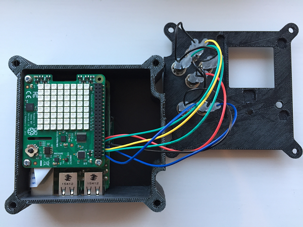

# 3D printed Astro Pi flight case

- [Back to 3D printing and setup](worksheet.md)

When you're happy with the 3D printed parts you can proceed with installing the hardware.

## Fold the camera ribbon

Getting the camera into the case can be a little tricky but here is how we did it for the flight units. Firstly, lift the two tabs on either side of the camera module to disconnect the ribbon cable from the camera. Then fold the ribbon. These folds allow the camera cable to come up the side of the Raspberry Pi with enough flex to insert into the CSI camera port (see further down).

1. Lay the ribbon out with the writing face up and the visible connectors on the left. At 1cm along the ribbon, fold the ribbon downwards.

  

2. Now measure 4cm from the top of the ribbon and fold the ribbon to the right.

  

3. Finally, measuring 4cm from the bottom left corner, fold the ribbon upwards.

  

4. Tape the ribbon on the bottom to prevent it from unfurling. We have used kapton tape but any kind of tape will work fine.

  

You don't need to get this perfect for it to work, but try to get it as close as possible.

## Install the camera

Reconnect the `Cam` end of the ribbon cable to the camera module. Make sure that the tin connectors are facing the front and the blue tab is on the back.

Before proceeding, line up the camera module with the support pillar pilot holes and have a look through the aperture in the base to check the alignment of the lens. The lens block of the camera module is actually glued in position at the factory, and therefore its alignment can vary slightly from camera to camera. If you find you've got an alignment issue, you should be able to manipulate the lens block between finger and thumb before you install it into the case permanently.

When you're happy, use the small black M2 cross head screws to install the camera module. The screws will cut their own thread in the support pillar pilot holes, but after just a few turns you'll probably need a small screwdriver to continue.


Stop turning as soon as the head of the screw touches the camera module; if you tighten the screw too much it can cause the support pillar to split horizontally along the grain of the print. Furthermore, try to avoid removing and re-threading the screws as this will cut a brand new thread and, if done repeatedly, will erode the inside of the support pillar so that the screws will not hold.

## Install the Raspberry Pi

Firstly, ensure there's no residual scaffolding material around the SD card slot or LED holes that might prevent the Raspberry Pi from lining up with the mounting pillars. Once you're happy, line up the Raspberry Pi and do a fit check. Verify that it doesn't touch the camera module below it. Don't insert the camera ribbon cable just yet, as this will make the next job awkward.


Next screw in the M2.5 - 11 mm stand offs at each corner of the Pi. With some light finger pressure they will cut their own thread in the support pillar pilot holes. After a few turns you'll need to use a small pair of pliers to continue turning them. It's possible to get these to go in at a slight angle, which can lead to alignment issues with the Sense HAT later on, so do your best to make sure these go into the support pillars as straight as possible. Be careful while you do this and, again, stop turning as soon as the stand off touches the Raspberry Pi to avoid splitting the pillars horizontally along the grain of the print.

Tip: If you are having trouble screwing the stand offs in, screw one of the silver M2.5 cross head screws into the stand off, then use the screw head to screw the stand off into the case. Once the stand off is in place, don't forget to remove the screw.


Now you can insert the camera ribbon cable into the CSI port of the Raspberry Pi. Try to make sure the tin connectors are all level to ensure a good connection.

## Install standoffs for the Sense HAT

This is where we're going to deviate from what's inside the Astro Pi flight unit. The flight units have another circuit board in between the Raspberry Pi and Sense HAT which holds a real-time clock, oscillator crystal, and backup battery. This RTC board also has some pins that the six push buttons connect to. Unfortunately, this is not available to the public.

Our goal was to keep the 3D printed flight case as *faithful* to the original as possible, so the decision was taken to *not* alter it to accommodate the absence of this board. It may be possible for us to release the Gerber files for it in the future so that people can make their own. We're going to use the hex nuts of the same depth as the RTC board to compensate for its absence.

Add the extended 23 way pin header to the Raspberry Pi GPIO pins, at the furthest end from the USB ports. Then, take an 8 mm M2.5 stand off and put a hex nut onto its thread before screwing it into the hole of the 11 mm stand off, as shown below. Do the same for the remaining three stand offs.



WARNING|&nbsp;
---|---
|Attention Pi 3 users. Using a **metal** stand off next to the wireless antenna will degrade its performance and range. The advice is to either omit this stand off from your build or use a nylon stand off and nylon screw instead.

Do not install the Sense HAT yet as it will get in the way when you connect the GPIO pins to the buttons.

## Install the push buttons

This section assumes you are using the buttons from the Astro Pi kit. If you are using the APEM buttons or another type of buttons, these may differ in their installation.

Take a button, then unscrew and remove the nut. Sometimes the nut will get stuck on the button cap, but it should come off if you wiggle it.


Keeping the washer on the thread, insert the button from the underside of the lid. Then on the top side of the lid, put the nut back on and tighten it with your fingers. Check that the connectors are aligned horizontally on the underside before tightening fully.



Do the same for the remaining buttons, and when you are done it should look like this:


If you are using the lid with the pilot holes then you'll need to check the datasheet of your chosen button type to find the *threaded bushing diameter*. Once you know this you can select a drill bit with this diameter, plus 1 mm for clearance, and proceed to drill all six holes. We recommend using a vice or G clamp to hold the lid in place while you drill. You can then install the buttons as per their requirements.

## Create the button wires

Firstly you need to prepare the button wires to be able to attach them to the buttons. In the real flight unit, we soldered the button wires on to make them more reliable, but in the kit you will find jumper wires which will do the same job. The colour of the wires is not important as they are all exactly the same inside.

Take a coloured wire and *without cutting it*, remove the black plastic sheath from **one** end by pulling it off with wire cutters or by pulling up the small tab and removing by hand. This exposes a pin connector. 

Pass a plastic insulation boot over the pin connector, narrow end first, and slide it out of the way down the wire. Then place the connector inside a crimp. 



Alternating the angle of your pliers, squash the crimp around the wire until there is no movement whatsoever of the pin connector within the crimp. Then slide the insulation boot back up over the wire and crimp. Repeat this 6 times with coloured wires to create the wires we will connect to the 6 buttons.


## Create a ground wire loop

To avoid having 6 more wires connected to the Raspberry Pi as ground wires, you will create a ground loop wire which connects to all of the buttons - this technique is also used in the real flight units. 

Take the length of black wire which should be approximately 50cm in length. Using a ruler and wire cutters, make five 10cm lengths. For each length, use wire strippers to expose at least 1cm of bare wire on both ends, then bend the wire into a U shape.



Now take a black jumper wire and remove one end to expose the connector, just as you did before. Hold the connector next to the end of one of your 10cm lengths of black wire, and pass both wires through the narrow end of an insulation boot. Insert both wires together into a crimp and tighten the crimp as before.


Connect up the four remaining lengths of black wire to create a chain, crimping together a new wire with the exposed bare end of the previous wire. You will be left with one bare wire end as in the photograph below.


For the final end, use pliers to fold over the bare wire to make it twice as thick before putting this wire alone inside a crimp and tightening up as before. You should end up with a chain containing six crimped ends and one black plastic jumper end.

## Connecting wires to the button terminals

First you will connect your ground loop to the buttons. Starting with the top button, take the crimped wire end furthest from the black plastic jumper lead. Slide down the insulation boot, hold the crimp between finger and thumb and push it all the way onto the button terminal. Once the crimp is firmly in place, slide the insulation boot back up. Repeat to attach one of the black ground wire connections to each of the six buttons.



Now take the coloured wires you made earlier and connect one crimped end to the spare terminal of each button, using exactly the same method.

## Connecting the buttons to the Raspberry Pi

Fit the middle section of the Astro Pi case onto the base. You should do this now as the GPIO wires will prevent it from being fitted later.

Now you are going to wire the buttons to the free GPIO pins at the bottom of the header. Turn the Astro Pi case so that the Ethernet and USB ports are at the bottom, and the GPIO pins are on the right of the Raspberry Pi.


The pins marked in red are where you will wire up the buttons, with the bottom of the diagram being the pins closest to the USB ports. 

Look at the **UNDERSIDE** of the lid, with the buttons on the left and the display hole on the right. Connect the coloured wire from each button to the corresponding pin below:

- Top four buttons
    - Top: GPIO 26
    - Bottom: GPIO 13
    - Left: GPIO 19
    - Right: GPIO 20
- Bottom pair of buttons
    - Left: GPIO 21
    - Right: GPIO 16

Finally, connect the ground wire to either pin 34 or 39 (labelled Ground on the GPIO diagram). 

The lid will now be a bit awkward until we finish, but try to position it gently so it is not in the way.

The picture below is of one of the flight units that went into space. On the right, you can see the base of the RTC board with the connector pins for the buttons. If you look at the button contacts on the left, you'll see we used only one black ground wire that went from button to button.


## Install the Sense HAT

Remove the GPIO connector that comes with the Sense HAT; wiggle it from side to side and it will come off without too much force. The Sense HAT can then be inserted onto the header. Note that these pins should not protrude through the top of the Sense HAT. If they do, then the height is not correct.


Finally, use the M2.5 cross head screws to secure the Sense HAT to the stand offs below.




## Test the buttons

Once you have all the buttons wired up, start up your Astro Pi with a monitor, keyboard and mouse connected. We need to download some files and change a few configuration settings. Firstly, download the Device Tree overlay that maps the push buttons to the corresponding keyboard keys. 

Open a terminal and enter these commands:

```bash
cd /boot/overlays
sudo wget https://github.com/raspberrypilearning/astro-pi-flight-case/raw/master/dtb/astropi-keys.dtbo --no-check-certificate
```

Type `ls` and check that the file `astropi-keys.dtbo` is now showing in the list of files.

Next, we need to configure `config.txt` to load this overlay:

```bash
sudo nano /boot/config.txt
```

Go to the bottom of the file and enter the line below:

```bash
dtoverlay=astropi-keys
```

Press `Ctrl - O` then `Enter` to save, followed by `Ctrl - X` to quit.

Now reboot the Astro Pi.

```bash
sudo reboot
```

Now let's download and run a Python test program to check everything is working. The test code uses [Pygame](http://pygame.org/wiki/tutorials), so please do this on the Astro Pi's own screen and not via remote access or it will not work. Open a terminal and enter these commands:

```bash
cd ~
wget https://github.com/raspberrypilearning/3d-printed-astro-pi-flight-case/raw/master/test_code/pygame_test.py --no-check-certificate
chmod +x pygame_test.py
./pygame_test.py
```

Waggle the joystick and press all the push buttons. If everything is working, the joystick should give a direction indication and the buttons will show the corresponding letter on the LED matrix. Press `Escape` to exit.

## Assemble the case

Once you're happy that the internals of the case are complete, you can proceed to the final assembly stage. If you haven't done so already, now is the time to use the epoxy adhesive to join the heat sink to the base and the lid to the middle.

When joining the lid to the middle, you have an opportunity to locate the lid so as to mitigate any alignment issues with the LED matrix and joystick that may have occurred from the stand offs not being quite straight. After the case is assembled, insert an M4 bolt into each corner bolt enclosure and tighten up the hex nuts on the other side.


Your Astro Pi is almost complete; the last thing to do is install the joystick hat. The flight units use a track point cap from a Lenovo ThinkPad laptop (part no 73P2698). There are plenty of cheaper alternatives available online that will work just as well.

To mount the track point cap onto the Sense HAT joystick, you should chop up an empty ink tube from a BIC biro - yes, this is what's used in the Space Station unit. Cut off a short length of the tube and, with some gentle force, the tube will fit over the stump of the joystick. It will also pop off again if too much force is used, which protects the cheap joystick component inside.

Fill the cavity on the base of the track point cap with some hot melt adhesive from a glue gun, and then insert the BIC tube into the soft adhesive. Allow this to cool, and then your joystick is ready for use.


## What next?

We've deliberately not shown a really polished gorgeous case, because we're hoping you'll go the extra mile and blow our socks off. Please show us your cases by tweeting pictures of them to `@astro_pi` and `@raspberry_pi`!

Here are some further ideas:

- Use metallic grey spray paint
- Use sandpaper to create the matt finish that the bead-blasted aluminium flight cases have
- Engrave decals into the case
- Use different colours of filament for each part

The STL files are released under the Creative Commons attribution [licence](http://creativecommons.org/licenses/by-sa/4.0/) so you are welcome to modify them. Please note that GitHub has a great [STL viewer](https://github.com/blog/1465-stl-file-viewing) and also has a [3D file diff](https://github.com/blog/1633-3d-file-diffs), which could be useful for tracking your changes.

But by far the greatest benefit of owning an Astro Pi flight unit is the ability to prototype and test code that could be run on the International Space Station. Head over to the [Astro Pi website](https://astro-pi.org/) now to get involved!
